# Backend Guide - ConvoInsight Platform

> Everything you need to understand the Django backend. Read this top-to-bottom in your first week.

---

## Table of Contents

1. [Architecture Overview](#architecture-overview)
2. [Project Structure](#project-structure)
3. [System Design](#system-design)
4. [Database Schema](#database-schema)
5. [API Layer](#api-layer)
6. [Authentication](#authentication)
7. [WebSockets (Real-time Chat)](#websockets-real-time-chat)
8. [Background Tasks (Celery)](#background-tasks-celery)
9. [LLM & AI Components](#llm--ai-components)
10. [ML Models](#ml-models)
11. [Configuration Reference](#configuration-reference)
12. [Common Patterns](#common-patterns)

---

## Architecture Overview

ConvoInsight follows a **layered monolith** pattern. Everything lives in one Django project, but the code is cleanly separated into domain apps.

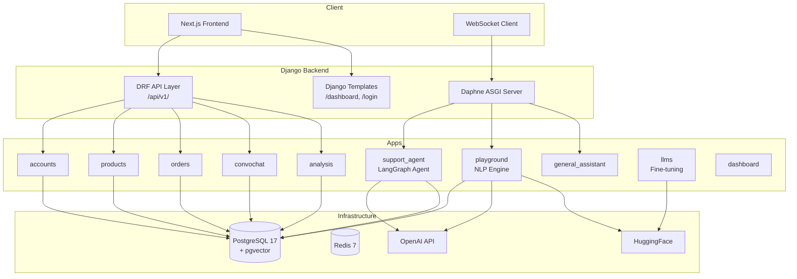

### How Requests Flow

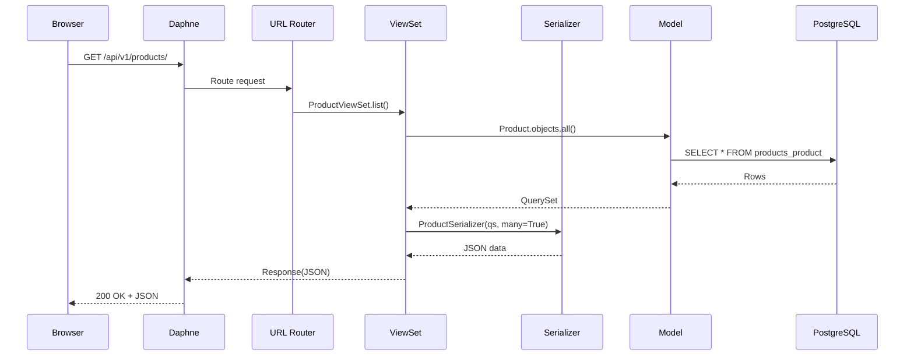

---

## Project Structure

```
backend/
├── config/                     # Django project config
│   ├── settings/
│   │   ├── base.py             # Main settings (DB, DRF, JWT, apps, logging)
│   │   ├── development.py      # Local dev overrides (DEBUG=True)
│   │   ├── production.py       # Production settings
│   │   └── test.py             # Test settings (SQLite, faster)
│   ├── celery.py               # Celery app config
│   ├── asgi.py                 # ASGI config (Daphne + Channels)
│   ├── wsgi.py                 # WSGI config
│   ├── urls.py                 # Root URL routing
│   └── models.py               # CreationModificationDateBase abstract model
│
├── apps/                        # Each app = a self-contained domain module
│   ├── accounts/               # Custom User model, auth views/forms
│   ├── products/               # Category, Product models
│   ├── orders/                 # Order, OrderItem, OrderTracking + management commands
│   ├── convochat/              # Conversation, Message, UserText, AIText, Sentiment, Topic, Intent
│   ├── analysis/               # LLMAgentPerformance, ConversationMetrics, Recommendation, etc.
│   ├── api/                    # REST API layer
│   │   ├── v1/                 # Versioned API (all endpoints live here)
│   │   │   ├── urls.py         # DefaultRouter with 21 ViewSets
│   │   │   ├── urls_auth.py    # JWT token endpoints
│   │   │   ├── views_*.py      # ViewSets (one file per domain)
│   │   │   ├── serializers_*.py # Serializers (one file per domain)
│   │   │   └── tests/          # API tests
│   │   ├── pagination.py       # StandardResultsSetPagination
│   │   └── ws_auth.py          # JWT auth middleware for WebSockets
│   ├── dashboard/              # Dashboard view + seed_demo command
│   ├── playground/             # NLP playground (3 methods: BERT, GPT, RAG)
│   │   ├── consumers.py        # WebSocket consumer + ModelManager
│   │   ├── sentiment_model_analysis.py   # Fine-tuned RoBERTa sentiment model
│   │   ├── intent_recognitionwith_tr_bert.py  # Fine-tuned BERT intent model
│   │   ├── text_classification_vector_store.py # PGVector store
│   │   ├── text_classification_rag_processor.py # RAG pipeline
│   │   └── sentiment_tr_model/ # Pre-trained model files
│   ├── support_agent/          # LangGraph e-commerce support agent
│   │   ├── consumers.py        # WebSocket consumer for agent chat
│   │   ├── sa_utils/           # Agent internals
│   │   │   ├── state.py        # InputState + ECommerceState
│   │   │   ├── graph_builder.py  # LangGraph StateGraph definition
│   │   │   ├── tool_manager.py   # Agent tools (track, modify, cancel, search)
│   │   │   ├── prompt_manager.py # System prompts per intent
│   │   │   ├── configuration.py  # Agent config + Pydantic schemas
│   │   │   ├── intent_router.py  # Intent detection
│   │   │   ├── context_manager.py # Conversation context
│   │   │   ├── flow_manager.py   # Conversation flow control
│   │   │   └── helper.py         # Model loading utilities
│   │   └── models.py           # ConversationSnapshot model
│   ├── general_assistant/      # General AI assistant (text + image + voice)
│   │   ├── consumers.py        # WebSocket consumer
│   │   ├── services.py         # AI service logic
│   │   └── models.py           # GeneralConversation, GeneralMessage, AudioMessage, ImageMessage
│   └── llms/                   # LLM fine-tuning + SageMaker
│       ├── fine_tuning/
│       │   └── llm_fine_tuner.py
│       ├── training_scripts/
│       │   ├── train_sentiment_model.py
│       │   ├── train_intent_model.py
│       │   └── train_topic_model.py
│       └── management/commands/ # fine_tune_llm, train_deploy_model, monitor_model
│
├── templates/                   # Django HTML templates
│   ├── base.html               # Bootstrap 5 base layout
│   ├── accounts/               # login.html, signup.html, profile.html
│   └── dashboard/              # dashboard.html
│
├── data_processing/             # Data ingestion scripts
├── ml_models/                  # Trained model files (gitignored)
├── static/                     # Static assets (CSS, JS)
├── manage.py                   # Django management command entry point
├── conftest.py                 # Shared pytest fixtures
├── pyproject.toml              # Ruff, pytest, coverage config
└── requirements.txt            # Python dependencies
```

### The Import Trick

Open `config/settings/base.py` line 9:

```python
sys.path.insert(0, str(BASE_DIR / "apps"))
```

This adds `apps/` to Python's path. So you write:

```python
from products.models import Product       # NOT from apps.products.models import Product
from orders.models import Order            # NOT from apps.orders.models import Order
```

---

## System Design

### Request Lifecycle

| Layer | Component | What it does |
|-------|-----------|-------------|
| **Server** | Daphne (ASGI) | Handles both HTTP and WebSocket connections |
| **Routing** | `config/urls.py` | Root URL conf, includes api urls and template views |
| **API** | `apps/api/v1/urls.py` | DRF `DefaultRouter` registers 21 ViewSets |
| **Views** | `apps/api/v1/views_*.py` | ViewSets handle CRUD + custom actions |
| **Serialization** | `apps/api/v1/serializers_*.py` | Converts model instances to/from JSON |
| **Models** | `apps/<domain>/models.py` | Django ORM models |
| **Database** | PostgreSQL 17 + pgvector | Relational data + vector embeddings |

### WebSocket Lifecycle

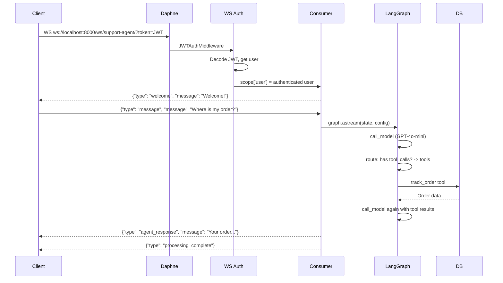

---

## Database Schema

### Entity Relationship Diagram

```mermaid
erDiagram
    USER {
        int id PK
        string username
        string email
        string first_name
        string last_name
        boolean is_staff
    }

    CATEGORY {
        int id PK
        string name
        string description
    }

    PRODUCT {
        int id PK
        string name
        string description
        decimal price
        int stock
        datetime created
        datetime modified
        int category_id FK
    }

    ORDER {
        int id PK
        string status "PE,PR,SH,TR,DE,RT,RF,CA"
        decimal total_amount
        string tracking_number
        string shipping_method "ST,EX,ON,LO"
        date estimated_delivery
        datetime shipped_date
        string delivery_address
        string carrier
        datetime created
        datetime modified
        int user_id FK
    }

    ORDER_ITEM {
        int id PK
        int quantity
        decimal price
        int order_id FK
        int product_id FK
    }

    ORDER_TRACKING {
        int id PK
        string status "PL,PR,PK,PA,SH,TR,OD,DE,FA,EX,RT"
        string location
        string description
        datetime timestamp
        datetime created
        datetime modified
        int order_id FK
    }

    ORDER_CONVERSATION_LINK {
        int id PK
        datetime created_at
        int order_id FK
        uuid conversation_id FK
    }

    CONVERSATION {
        uuid id PK
        string title
        string status "AC,AR,EN"
        string current_intent
        float overall_sentiment_score
        string summary
        string resolution_status "RE,PR,UN"
        datetime created
        datetime modified
        int user_id FK
        uuid dominant_topic_id FK
    }

    MESSAGE {
        int id PK
        string content_type "AU,DO,IM,TE"
        boolean is_from_user
        datetime created
        datetime modified
        uuid conversation_id FK
        int in_reply_to_id FK
    }

    USER_TEXT {
        int id PK
        string content
        float sentiment_score
        int message_id FK
        int intent_id FK
        int primary_topic_id FK
    }

    AI_TEXT {
        int id PK
        string content
        float confidence_score
        int message_id FK
        int recommendation_id FK
        json tool_calls
    }

    INTENT {
        int id PK
        string name "UK"
        string description
    }

    TOPIC {
        int id PK
        string name "UK"
        string description
        string category "PR,OR,PA,EX"
        float priority_weight
        int usage_count
        boolean is_active
        datetime created
        datetime modified
    }

    SENTIMENT_CATEGORY {
        int id PK
        string name "UK"
        string description
        float priority_weight
    }

    GRANULAR_EMOTION {
        int id PK
        string name "UK"
        string description
        int usage_count
        int associated_sentiment_id FK
    }

    SENTIMENT {
        int id PK
        float score "-1 to 1"
        float confidence "0 to 1"
        int category_id FK
        int granular_emotion_id FK
        int message_id FK "OneToOne"
    }

    LLM_AGENT_PERFORMANCE {
        int id PK
        duration response_time
        float accuracy_score
        float relevance_score
        float customer_satisfaction_score
        float quality_score
        string feedback
        boolean issue_resolved
        float overall_score
        datetime evaluated_at
        uuid conversation_id FK
    }

    CONVERSATION_METRICS {
        int id PK
        float overall_satisfaction_score
        duration average_response_time
        float average_accuracy_score
        float average_relevance_score
        float sentiment_score
        string feedback
        datetime evaluated_at
        uuid conversation_id FK "OneToOne"
    }

    RECOMMENDATION {
        int id PK
        string content
        float confidence_score
        datetime created_at
        boolean is_applied
        uuid conversation_id FK
    }

    TOPIC_DISTRIBUTION {
        int id PK
        float weight
        uuid conversation_id FK
        int topic_id FK
    }

    INTENT_PREDICTION {
        int id PK
        string intent
        float confidence_score
        int message_id FK "OneToOne"
    }

    CONVERSATION_SNAPSHOT {
        uuid id PK
        json state_data
        json metrics_data
        int total_messages
        int user_messages
        int ai_messages
        int intent_changes
        int tool_uses
        float avg_response_time
        string current_intent
        string previous_intent
        string snapshot_type "AU,MN,EV,FN"
        datetime created
        datetime modified
        uuid conversation_id FK
    }

    RAG_TEXT_CLASSIFICATION_DOCUMENT {
        int id PK
        string task "SE,IN,TO"
        string content
        json metadata
        vector embedding "384 dims"
        datetime created_at
    }

    GENERAL_CONVERSATION {
        uuid id PK
        string title
        string status "AC,AR,EN"
        datetime created
        datetime modified
        int user_id FK
    }

    GENERAL_MESSAGE {
        int id PK
        string content_type "TE,IM,AU,VI,DO"
        string content
        boolean is_from_user
        datetime created
        datetime modified
        uuid conversation_id FK
        int in_reply_to_id FK
    }

    AUDIO_MESSAGE {
        int id PK
        string audio_file
        string transcript
        float duration
        int message_id FK "OneToOne"
    }

    IMAGE_MESSAGE {
        int id PK
        string image
        int width
        int height
        string description
        int message_id FK "OneToOne"
    }

    USER ||--o{ ORDER : "places"
    USER ||--o{ CONVERSATION : "has"
    USER ||--o{ GENERAL_CONVERSATION : "has"
    CATEGORY ||--o{ PRODUCT : "contains"
    ORDER ||--o{ ORDER_ITEM : "has"
    ORDER ||--o{ ORDER_TRACKING : "tracked by"
    ORDER ||--o{ ORDER_CONVERSATION_LINK : "linked to"
    PRODUCT ||--o{ ORDER_ITEM : "included in"
    CONVERSATION ||--o{ MESSAGE : "contains"
    CONVERSATION ||--o{ TOPIC_DISTRIBUTION : "has"
    CONVERSATION ||--o{ RECOMMENDATION : "receives"
    CONVERSATION ||--|| CONVERSATION_METRICS : "measured by"
    CONVERSATION ||--o{ LLM_AGENT_PERFORMANCE : "evaluated in"
    CONVERSATION ||--o{ CONVERSATION_SNAPSHOT : "snapshotted"
    CONVERSATION ||--o{ ORDER_CONVERSATION_LINK : "linked to"
    CONVERSATION }o--o| TOPIC : "dominant topic"
    MESSAGE ||--o| USER_TEXT : "has text"
    MESSAGE ||--o| AI_TEXT : "has response"
    MESSAGE ||--o| MESSAGE : "replies to"
    USER_TEXT ||--o| INTENT : "classified as"
    USER_TEXT ||--o| TOPIC : "about"
    USER_TEXT ||--|| SENTIMENT : "analyzed by"
    SENTIMENT }o--|| SENTIMENT_CATEGORY : "category"
    SENTIMENT }o--o| GRANULAR_EMOTION : "emotion"
    GRANULAR_EMOTION }o--|| SENTIMENT_CATEGORY : "belongs to"
    AI_TEXT }o--o| RECOMMENDATION : "based on"
    INTENT_PREDICTION ||--|| USER_TEXT : "predicts"
    TOPIC_DISTRIBUTION }o--|| TOPIC : "references"
    GENERAL_CONVERSATION ||--o{ GENERAL_MESSAGE : "contains"
    GENERAL_MESSAGE ||--o| AUDIO_MESSAGE : "has audio"
    GENERAL_MESSAGE ||--o| IMAGE_MESSAGE : "has image"
    GENERAL_MESSAGE ||--o{ GENERAL_MESSAGE : "replies to"
```

### Key Model Details

#### Status Enums

| Model | Field | Choices |
|-------|-------|---------|
| `Conversation` | `status` | AC=Active, AR=Archived, EN=Ended |
| `Conversation` | `resolution_status` | RE=Resolved, PR=In Progress, UN=Unresolved |
| `Order` | `status` | PE=Pending, PR=Processing, SH=Shipped, TR=In Transit, DE=Delivered, RT=Returned, RF=Refunded, CA=Cancelled |
| `Order` | `shipping_method` | ST=Standard, EX=Express, ON=Overnight, LO=Local |
| `OrderTracking` | `status` | PL=Order Placed, PR=Processing, PK=Picked, PA=Packed, SH=Shipped, TR=In Transit, OD=Out for Delivery, DE=Delivered, FA=Failed Attempt, EX=Exception, RT=Returned |
| `Message` | `content_type` | AU=Audio, DO=Document, IM=Image, TE=Text |
| `Topic` | `category` | PR=Product-Related, OR=Order Management, PA=Payment & Account, EX=Customer Experience |
| `ConversationSnapshot` | `snapshot_type` | AU=Automatic, MN=Manual, EV=Event, FN=Final |

#### Abstract Base Class

Most models inherit from `CreationModificationDateBase` (defined in `config/models.py`):

```python
class CreationModificationDateBase(models.Model):
    created = models.DateTimeField(auto_now_add=True)
    modified = models.DateTimeField(auto_now=True)

    class Meta:
        abstract = True
```

Models using it: `Product`, `Order`, `OrderTracking`, `Conversation`, `Message`, `ConversationSnapshot`, `GeneralConversation`, `GeneralMessage`.

#### Vector Search

The `RAGTextClassificationDocument` model uses **pgvector** for vector similarity search:

```python
embedding = VectorField(dimensions=384)  # 384-dimensional embeddings
```

An **IVFFlat index** is created for fast cosine similarity queries. This is used by the RAG method in the NLP playground.

---

## API Layer

### Structure

The API lives in `apps/api/v1/`. It uses DRF's `DefaultRouter` to auto-generate URL patterns from ViewSets.

### All 21 ViewSets

| ViewSet | File | URL Prefix | Description |
|---------|------|-----------|-------------|
| `ProductViewSet` | `views_products.py` | `/api/v1/products/` | CRUD + `in-stock`, `low-stock`, `featured` actions |
| `CategoryViewSet` | `views_products.py` | `/api/v1/categories/` | CRUD + nested products list |
| `OrderViewSet` | `views_orders.py` | `/api/v1/orders/` | CRUD + tracking |
| `OrderItemViewSet` | `views_orders.py` | `/api/v1/order-items/` | CRUD |
| `OrderTrackingViewSet` | `views_orders.py` | `/api/v1/order-tracking/` | CRUD |
| `ConversationViewSet` | `views_conversations.py` | `/api/v1/conversations/` | CRUD + `archive`, `end` |
| `MessageViewSet` | `views_conversations.py` | `/api/v1/messages/` | CRUD |
| `UserTextViewSet` | `views_conversations.py` | `/api/v1/user-texts/` | CRUD |
| `AITextViewSet` | `views_conversations.py` | `/api/v1/ai-texts/` | CRUD |
| `IntentViewSet` | `views_conversations.py` | `/api/v1/intents/` | CRUD |
| `TopicViewSet` | `views_conversations.py` | `/api/v1/topics/` | CRUD + `trending` |
| `SentimentViewSet` | `views_conversations.py` | `/api/v1/sentiments/` | CRUD |
| `SentimentCategoryViewSet` | `views_conversations.py` | `/api/v1/sentiment-categories/` | CRUD |
| `GranularEmotionViewSet` | `views_conversations.py` | `/api/v1/granular-emotions/` | CRUD |
| `LLMAgentPerformanceViewSet` | `views_analysis.py` | `/api/v1/agent-performance/` | Read-only |
| `ConversationMetricsViewSet` | `views_analysis.py` | `/api/v1/conversation-metrics/` | Read-only |
| `RecommendationViewSet` | `views_analysis.py` | `/api/v1/recommendations/` | Read-only |
| `TopicDistributionViewSet` | `views_analysis.py` | `/api/v1/topic-distributions/` | Read-only |
| `IntentPredictionViewSet` | `views_analysis.py` | `/api/v1/intent-predictions/` | Read-only |
| `UserViewSet` | `views_accounts.py` | `/api/v1/users/` | List + retrieve + `me` |
| `NLPAnalysisViewSet` | `views_nlp.py` | `/api/v1/nlp/` | `sentiment`, `intent`, `topic`, `ner` actions |

### Custom Actions

The `@action` decorator adds extra endpoints to ViewSets:

| ViewSet | Action | Method | URL | What it does |
|---------|--------|--------|-----|-------------|
| `ProductViewSet` | `in_stock` | GET | `/products/in-stock/` | Products with stock > 0 |
| `ProductViewSet` | `low_stock` | GET | `/products/low-stock/?threshold=5` | Products with stock <= threshold |
| `ProductViewSet` | `featured` | GET | `/products/featured/` | Products with stock > 50 |
| `CategoryViewSet` | `products` | GET | `/categories/{id}/products/` | Products in that category |
| `ConversationViewSet` | `archive` | POST | `/conversations/{id}/archive/` | Archive a conversation |
| `ConversationViewSet` | `end` | POST | `/conversations/{id}/end/` | End a conversation |
| `NLPAnalysisViewSet` | `sentiment` | POST | `/nlp/sentiment/` | Run sentiment analysis |
| `NLPAnalysisViewSet` | `intent` | POST | `/nlp/intent/` | Run intent recognition |
| `NLPAnalysisViewSet` | `topic` | POST | `/nlp/topic/` | Run topic classification |
| `NLPAnalysisViewSet` | `ner` | POST | `/nlp/ner/` | Run named entity recognition |

### Pagination

All list endpoints are paginated via `StandardResultsSetPagination`:

```json
{
  "count": 42,
  "next": "http://localhost:8000/api/v1/products/?page=2",
  "previous": null,
  "results": [...]
}
```

### Filtering, Search, Ordering

Most ViewSets support:
- **Filtering**: `?category=1&stock=0` (via `django-filters`)
- **Search**: `?search=phone` (full-text search on configured fields)
- **Ordering**: `?ordering=-price` (prefix with `-` for descending)

### Interactive Docs

- **Swagger UI**: http://localhost:8000/api/docs/
- **Redoc**: http://localhost:8000/api/redoc/
- **OpenAPI Schema**: `python manage.py spectacular --file schema.yml`

---

## Authentication

### JWT Flow

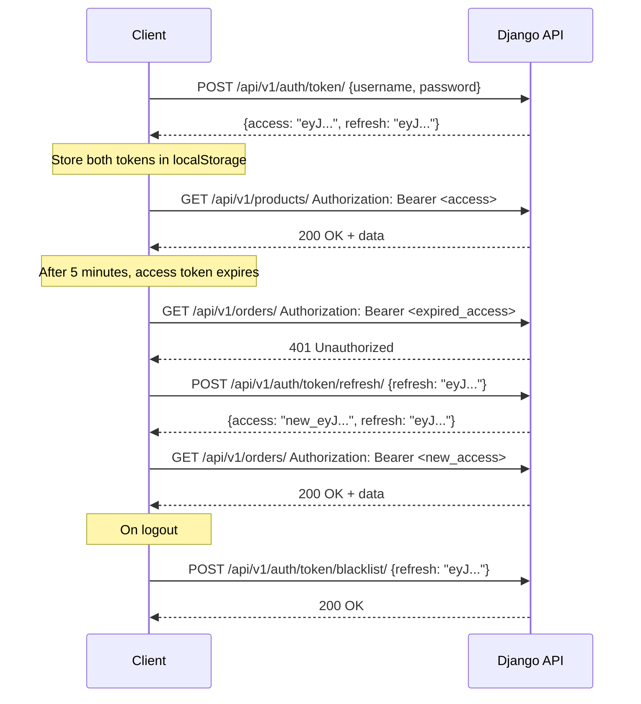

### JWT Endpoints

| Endpoint | Method | Body | Returns |
|----------|--------|------|---------|
| `/api/v1/auth/token/` | POST | `{username, password}` | `{access, refresh}` |
| `/api/v1/auth/token/refresh/` | POST | `{refresh}` | `{access, refresh}` |
| `/api/v1/auth/token/verify/` | POST | `{token}` | `{}` (200 = valid) |
| `/api/v1/auth/token/blacklist/` | POST | `{refresh}` | `{}` (200 = blacklisted) |

### WebSocket Authentication

WebSockets can't send HTTP headers, so auth uses a **query parameter**:

```javascript
const ws = new WebSocket(`ws://localhost:8000/ws/support-agent/?token=${accessToken}`);
```

The `JWTAuthMiddleware` in `apps/api/ws_auth.py`:
1. Extracts `?token=` from the query string
2. Decodes the JWT using `UntypedToken`
3. Looks up the user by `user_id` claim
4. Sets `scope['user']` for the consumer

---

## WebSockets (Real-time Chat)

### WebSocket Routes

| Path | Consumer | Purpose |
|------|----------|---------|
| `ws://.../ws/support-agent/<conversation_id>/` | `SupportAgentConsumer` | LangGraph e-commerce support agent |
| `ws://.../ws/playground/` | `NLPPlaygroundConsumer` | NLP analysis playground |
| `ws://.../ws/general-assistant/` | `GeneralAssistantConsumer` | General AI assistant |

### How to Test WebSockets

From browser console (F12):

```javascript
// 1. Get a JWT token
const resp = await fetch('http://localhost:8000/api/v1/auth/token/', {
  method: 'POST',
  headers: {'Content-Type': 'application/json'},
  body: JSON.stringify({username: 'demo_user_01', password: 'demo12345'})
});
const {access} = await resp.json();

// 2. Connect to support agent
const ws = new WebSocket(`ws://localhost:8000/ws/support-agent/test-conv-1/?token=${access}`);

ws.onopen = () => {
  ws.send(JSON.stringify({
    type: 'chat_message',
    message: 'Where is my order #1?'
  }));
};

ws.onmessage = (e) => console.log(JSON.parse(e.data));
```

---

## Background Tasks (Celery)

### Architecture

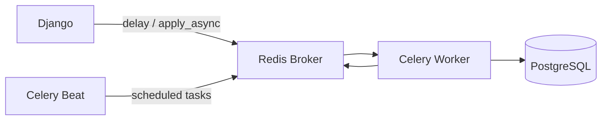

### Key Files

| File | Purpose |
|------|---------|
| `config/celery.py` | Celery app initialization, broker config |
| `apps/orders/tasks.py` | Order-related async tasks |
| `apps/llms/tasks.py` | Model training tasks |

### Running Celery

```bash
# Terminal 1: Celery worker
cd backend && celery -A config worker -l info

# Terminal 2: Celery beat (scheduled tasks, optional)
cd backend && celery -A config beat -l info
```

### Using Celery in Code

```python
from orders.tasks import some_task

# Send task to queue (non-blocking)
result = some_task.delay(arg1, arg2)

# Or with countdown
result = some_task.apply_async(args=[arg1, arg2], countdown=60)

# Check status
result.id       # task UUID
result.status   # PENDING, STARTED, SUCCESS, FAILURE
result.get()    # blocks until result is ready (don't use in views!)
```

---

## LLM & AI Components

### Overview of AI/ML in ConvoInsight

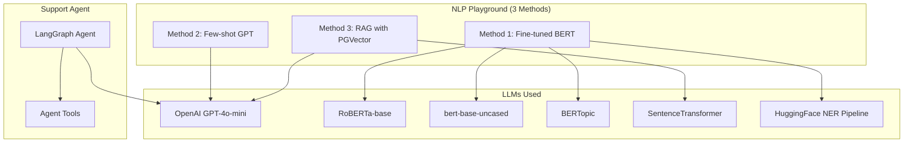

### 1. Support Agent (LangGraph)

**Location**: `apps/support_agent/sa_utils/`

The support agent is a **LangGraph StateGraph** that handles e-commerce customer support conversations.

#### LangGraph Graph Structure

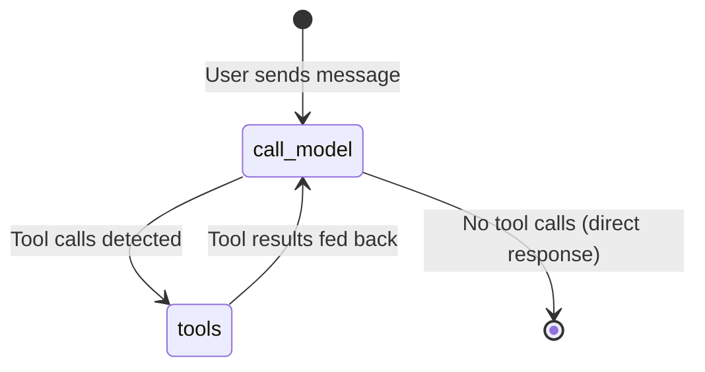

#### State Schema (`state.py`)

```python
@dataclass
class InputState:
    messages: Annotated[Sequence[AnyMessage], add_messages]  # Chat history

@dataclass
class ECommerceState(InputState):
    order_info: Dict           # Current order being discussed
    user_info: Dict            # Authenticated user info
    intent: str                # Detected intent
    conversation_id: str       # Active conversation UUID
    confirmation_pending: bool # Waiting for user confirmation
    completed: bool            # Conversation finished
    context: Dict              # Additional context
    is_last_step: IsLastStep   # Managed by LangGraph (recursion limit)
```

#### Agent Tools (`tool_manager.py`)

| Tool | Sensitivity | What it does |
|------|-------------|-------------|
| `web_search(query)` | Safe | DuckDuckGo web search |
| `track_order(order_id, customer_id)` | Safe | Get order tracking info from DB |
| `modify_order_quantity(order_id, customer_id, product_id, qty)` | **Sensitive** | Change item quantity (needs confirmation) |
| `cancel_order(order_id, customer_id, reason)` | **Sensitive** | Cancel an order (needs confirmation) |
| `search_products(query, category, max_price, min_price)` | Safe | Search mock product catalog |
| `get_cart(user_id)` | Safe | Get user's shopping cart |
| `update_cart(user_id, product_id, quantity)` | Safe | Update shopping cart |

Sensitive tools (`modify_order_quantity`, `cancel_order`) require **user confirmation** before execution.

#### Prompts (`prompt_manager.py`)

The `PromptManager` maintains specialized system prompts for each intent:

| Intent | When Used |
|--------|-----------|
| `track_order` | Order tracking queries |
| `modify_order_quantity` | Quantity change requests |
| `cancel_order` | Cancellation requests |
| `order_detail` | General order info queries |
| `delivery_issue` | Delivery problems |

#### Agent Configuration (`configuration.py`)

| Setting | Default | Description |
|---------|---------|-------------|
| `model` | `openai/gpt-4o-mini` | LLM model |
| `max_search_results` | 5 | Max web search results |
| `tool_timeout` | 30s | Tool execution timeout |
| `max_tool_retries` | 3 | Retry count for failed tools |

### 2. General Assistant

**Location**: `apps/general_assistant/`

A multi-modal AI assistant that handles:
- **Text** conversations
- **Image** messages (upload + description)
- **Audio/Voice** messages (recording + transcription via Google SpeechRecognition)

### 3. LLM Fine-tuning

**Location**: `apps/llms/`

Training scripts for fine-tuning models:
- `training_scripts/train_sentiment_model.py` - Fine-tune sentiment classifier
- `training_scripts/train_intent_model.py` - Fine-tune intent classifier
- `training_scripts/train_topic_model.py` - Fine-tune topic classifier
- `fine_tuning/llm_fine_tuner.py` - LLM fine-tuning pipeline
- Management commands: `fine_tune_llm`, `train_deploy_model`, `monitor_model`

---

## ML Models

### Model Inventory

| Model | Base | Task | Location | Dimensions |
|-------|------|------|----------|-----------|
| **Sentiment Classifier** | RoBERTa-base | 6-class emotion detection | `playground/sentiment_tr_model/` | 768 hidden |
| **Intent Classifier** | bert-base-uncased | Category + Intent classification | Configured via `FINETUNED_MODELS` setting | 768 hidden |
| **Topic Model** | BERTopic + SentenceTransformer | Topic clustering | Configured via `FINETUNED_MODELS` setting | 384 embedding |
| **NER Pipeline** | HuggingFace NER pipeline | Named entity recognition | Configured via `FINETUNED_MODELS` setting | Varies |
| **RAG Embeddings** | SentenceTransformer (384d) | Vector similarity for RAG | `playground/text_classification_vector_store.py` | 384 dims |

### Sentiment Classifier Details

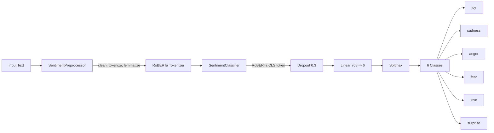

The `EcommerceSentimentMapper` maps these 6 base emotions to e-commerce-specific sentiments:

| Base Emotion | E-commerce Granular | General Sentiment |
|-------------|--------------------|--------------------|
| joy | Satisfaction | Positive |
| love | Gratitude | Positive |
| surprise | Appreciation | Positive |
| sadness | Disappointment | Negative |
| anger | Frustration | Negative |
| fear | Urgency | Negative |

Confidence threshold: **0.45** (below this = Neutral).

### Intent Classifier Details

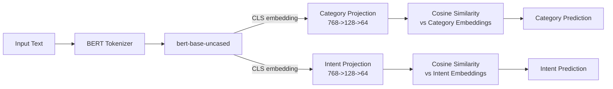

Uses **cosine similarity** between projected BERT embeddings and learned label embeddings (not direct classification). This allows adding new intents without retraining the full model.

### RAG Pipeline Details

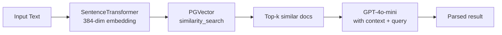

The `RAGTextClassificationDocument` stores documents with their embeddings in PostgreSQL using the **pgvector** extension. An IVFFlat index enables fast cosine similarity search.

---

## Configuration Reference

### Environment Variables

| Variable | Required | Description |
|----------|----------|-------------|
| `DEBUG` | No | Enable debug mode (default: True) |
| `SECRET_KEY` | Yes | Django secret key |
| `DB_NAME`, `DB_USER`, `DB_PASSWORD`, `DB_HOST`, `DB_PORT` | Yes | PostgreSQL connection |
| `OPENAI_API_KEY` | Yes | For GPT-4o-mini (NLP, support agent) |
| `HUGGINGFACEHUB_API_TOKEN` | Yes | For HuggingFace model access |
| `TAVILY_API_KEY` | No | For web search in support agent |
| `CELERY_BROKER_URL` | Yes | Redis URL for Celery |
| `GPT_MINI` | No | OpenAI model name (default: gpt-4o-mini) |
| `FINETUNED_MODELS` | No | Dict of paths to fine-tuned model directories |

### Settings Files

| File | When Used | Key Differences |
|------|-----------|----------------|
| `config/settings/base.py` | Always | All shared config, apps, DRF, JWT, Celery |
| `config/settings/development.py` | `DJANGO_SETTINGS_MODULE=config.settings.development` | DEBUG=True, local DB |
| `config/settings/production.py` | `DJANGO_SETTINGS_MODULE=config.settings.production` | DEBUG=False, secure cookies |
| `config/settings/test.py` | `DJANGO_SETTINGS_MODULE=config.settings.test` | SQLite, faster tests |

---

## Common Patterns

### Adding a New API Endpoint

1. **Add the model** (if needed) in `apps/<domain>/models.py`
2. **Create the migration**: `python manage.py makemigrations`
3. **Create a serializer** in `apps/api/v1/serializers_<domain>.py`
4. **Create a ViewSet** in `apps/api/v1/views_<domain>.py`
5. **Register the ViewSet** in `apps/api/v1/urls.py`
6. **Write tests** in `apps/api/v1/tests/`
7. **Verify**: Check Swagger UI at `/api/docs/`

### Adding a Custom Action

```python
# In your ViewSet
from rest_framework.decorators import action
from rest_framework.response import Response

class MyViewSet(viewsets.ModelViewSet):
    # ...

    @action(detail=False, methods=['get'], url_path='my-action')
    def my_action(self, request):
        qs = self.get_queryset().filter(some_field='value')
        serializer = self.get_serializer(qs, many=True)
        return Response(serializer.data)
```

- `detail=False` = collection-level action (no ID in URL)
- `detail=True` = single-object action (ID in URL)

### Adding a Celery Task

```python
# In apps/<app>/tasks.py
from config.celery import app

@app.task
def my_background_task(arg1, arg2):
    # Do slow work here
    return result

# Call it from anywhere
my_background_task.delay(arg1, arg2)
```

### Adding a WebSocket Consumer

1. Create `consumers.py` in your app
2. Create `routing.py` with URL patterns
3. Register in `config/asgi.py`
4. Auth: use `JWTAuthMiddlewareStack` from `apps/api/ws_auth.py`
