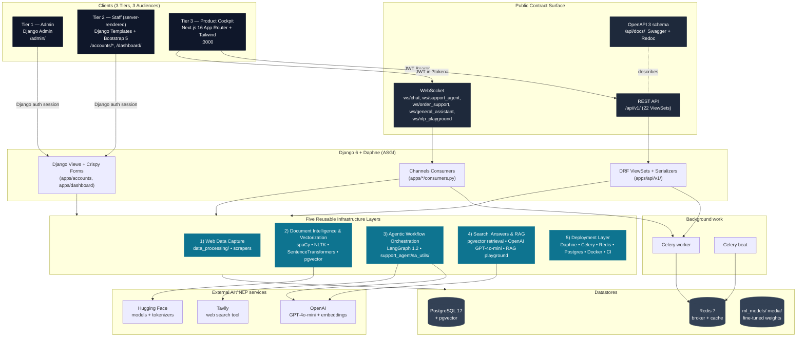

# ConvoInsight — Architecture (one picture)

> One diagram. One source of truth. Read this before you read any per-app guide.
>
> For the build-out plans, see [backend/docs/VISION.md](../backend/docs/VISION.md), [frontend/docs/VISION.md](../frontend/docs/VISION.md), and [frontend/docs/STRATEGY.md](../frontend/docs/STRATEGY.md). For the surface-tier rules, see [backend/docs/SURFACE_TIERS.md](../backend/docs/SURFACE_TIERS.md).

---

## 1. The Whole Platform in One Diagram



---

## 2. The Three Tiers (Clients)

Three audiences → three tiers. Each tier has a fixed remit and **a feature lives in exactly one tier**.

| Tier | Implementation | Audience | Owns |
|---|---|---|---|
| **1 — Admin** | Django admin (`/admin/`) | Engineers, data ops | Power-user data ops, debugging, seed inspection |
| **2 — Staff (server-rendered)** | Django templates + Bootstrap 5 + `crispy-forms` (`backend/templates/`) | Internal users, staff | Auth (login, signup, password reset, profile), internal staff dashboard. **Frozen scope** — no new routes are added here; the existing pages are edited in place only. |
| **3 — Product Cockpit** | Next.js 16 + Tailwind + Auth.js (`frontend/`) | End customers, operators | All new product surfaces: customer chat, operator live-queue, NLP playground comparison view, analytics cockpit. **All new user-visible features land here.** |

Full rules and examples: [backend/docs/SURFACE_TIERS.md](../backend/docs/SURFACE_TIERS.md).

---

## 3. The Contract Surface

All three tiers ultimately speak to the same Django process, but through different boundaries:

- **Tiers 1 & 2** call Django views directly (same process, server-rendered, session cookies).
- **Tier 3** speaks only through the public contracts: **REST under `/api/v1/`** and **WebSockets under `/ws/`**, both JWT-authenticated.

| Contract | What it carries |
|---|---|
| `/api/v1/*` (22 ViewSets) | Products, orders, conversations, messages, sentiments, topics, intents, analysis, NLP analysis, users, JWT auth |
| `ws/chat/<id>/` | Core conversation channel |
| `ws/support_agent/<id>/` | LangGraph e-commerce agent with tool calls |
| `ws/order_support/<id>/` | Order-scoped support |
| `ws/general_assistant/<id>/` | Multimodal (text + image + voice) assistant |
| `ws/nlp_playground/` | Streaming NLP playground (BERT • GPT • RAG) |
| `/api/docs/`, `/api/redoc/` | Live OpenAPI 3 schema |

OpenAPI is the source of truth for the REST contract. WebSocket message shapes are documented inside each consumer module.

---

## 4. The Five Infrastructure Layers

The same five layers power every feature. We do not rebuild them per product; we configure them per use case.

| # | Layer | What it does | Where it lives |
|---|---|---|---|
| 1 | **Web Data Capture** | Ingest content from web pages, files, and APIs | `backend/data_processing/`, scraper utilities |
| 2 | **Document Intelligence & Vectorization** | Tokenize, embed, and store text for retrieval | `apps/playground/text_classification_vector_store.py`, pgvector models |
| 3 | **Agentic Workflow Orchestration** | Multi-step LLM workflows with tool calling | `apps/support_agent/sa_utils/` (9 modules, LangGraph StateGraph) |
| 4 | **Search, Answers & RAG** | Retrieval + LLM answer composition | `apps/playground/text_classification_rag_processor.py`, GPT pipelines |
| 5 | **Deployment Layer** | Async server, background jobs, schedulers, DB, containers, CI | Daphne, Celery, Redis, Postgres, Docker, GitHub Actions |

Each app under `backend/apps/` is a configuration of one or more of these layers.

---

## 5. Request Lifecycles

### REST (cockpit → backend)

```
Browser → Next.js (cockpit) → fetch /api/v1/...  (Authorization: Bearer <JWT>)
                                   ↓
                Daphne → DRF router → ViewSet → Serializer → Model → PostgreSQL
                                   ↓
                          JSON response → cockpit → UI
```

### WebSocket (cockpit → agent)

```
Cockpit opens ws://.../ws/support_agent/<id>/?token=<JWT>
                       ↓
       Daphne → JWTAuthMiddleware (apps/api/ws_auth.py) → scope['user']
                       ↓
       SupportAgentConsumer → LangGraph StateGraph (call_model ↔ tools)
                       ↓ stream
          Tokens + tool-call events → cockpit → UI
```

### Server-rendered (staff → backend)

```
Browser → Daphne → Django view → Template → HTML → Browser
                       ↑
              Django auth session cookie
```

### Background work

```
Anything slow → enqueue Celery task on Redis → Celery worker picks up → writes to Postgres
Scheduled jobs → Celery beat → Redis → Celery worker
```

---

## 6. Authentication Posture

| Surface | Mechanism | Notes |
|---|---|---|
| Django admin (Tier 1) | Django session | Default Django auth |
| Staff templates (Tier 2) | Django session + `allauth` | Login, signup, password reset, profile, social login |
| Cockpit REST (Tier 3) | JWT (access + refresh + blacklist) | Issued by `/api/v1/auth/token/`. Held by **Auth.js v5** on the cockpit in an encrypted session cookie (replaces the legacy `localStorage` flow). |
| Cockpit WS (Tier 3) | Same JWT via `?token=...` | Validated by `JWTAuthMiddleware` in `apps/api/ws_auth.py` |

Django is the **canonical identity store** for all tiers. Auth.js never owns identity; it owns the cockpit's session.

---

## 7. Tech Stack Snapshot (today)

| Layer | Technology | Version |
|---|---|---|
| Backend framework | Django | 6.0.5 |
| API | DRF + drf-spectacular | 3.17 / 0.29 |
| Async server | Daphne + Channels | 4.2 / 4.3 |
| Database | PostgreSQL + pgvector | 17 |
| Queue / cache | Celery + Redis | 5.6 / 7 |
| LLM orchestration | LangChain + LangGraph | 1.3 / 1.2 |
| ML / NLP | PyTorch + Transformers + spaCy + NLTK + BERTopic | current |
| Cockpit | Next.js + React | 16.2.6 / 19.2.6 |
| Cockpit auth | Auth.js (next-auth v5) | 5.0.0-beta.31 |
| Styling | TailwindCSS | 3.4 |
| Containers | Docker multi-stage + Compose | — |
| CI | GitHub Actions | lint → test → build + security |

---

## 8. Where to Go Next

| If you want to … | Read |
|---|---|
| Build a Day-1 mental map of every app | [docs/MENTAL_MODEL.md](./MENTAL_MODEL.md) |
| Understand why we ship three tiers | [backend/docs/SURFACE_TIERS.md](../backend/docs/SURFACE_TIERS.md) |
| Deep-dive the backend | [backend/docs/BACKEND_GUIDE.md](../backend/docs/BACKEND_GUIDE.md) |
| Deep-dive the cockpit | [frontend/docs/FRONTEND_GUIDE.md](../frontend/docs/FRONTEND_GUIDE.md) |
| Plan a contribution | [backend/docs/VISION.md](../backend/docs/VISION.md), [frontend/docs/STRATEGY.md](../frontend/docs/STRATEGY.md) |
| Implement cockpit auth with Auth.js | [frontend/docs/AUTHJS_INTEGRATION.md](../frontend/docs/AUTHJS_INTEGRATION.md) |
| Onboard as an intern | [docs/INTERN_ONBOARDING.md](./INTERN_ONBOARDING.md) |
