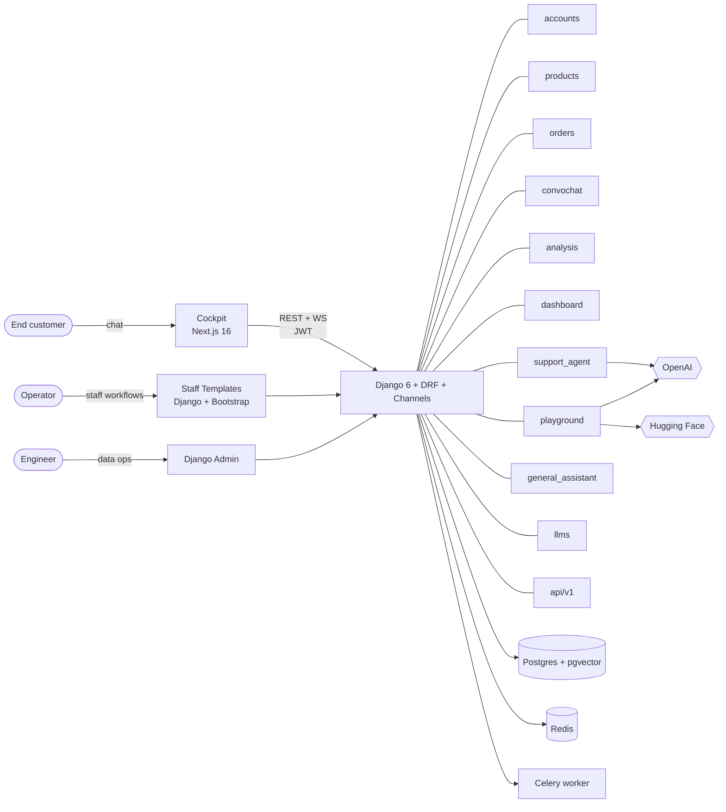

# ConvoInsight — Mental Model (Day 1)

> One page. One diagram. One paragraph per app. No code.
>
> Read this **first**. Use [BACKEND_GUIDE](../backend/docs/BACKEND_GUIDE.md) as the encyclopaedia when you actually start coding.

---

## The Picture

That is the whole system. Three audiences, three tiers, one Django process, ten apps, one Postgres, one Redis, one Celery, three external AI services.

---

## One Paragraph Per App

**accounts.** The platform's identity layer. Defines the custom `User` model and the Django views and crispy forms behind every login, signup, password reset, and profile page on the staff templates tier. Every other app trusts the user object that accounts produces.

**products.** The product catalogue. Two simple models — `Category` and `Product` — that back the e-commerce surface the support agent operates on. The simplest app in the repo and the right place to read first if you have never touched Django ORM before.

**orders.** Orders, their line items, their tracking history, and the link table that ties an order to a conversation. Owns its own WebSocket consumer for order-scoped support and the management commands that generate dummy order data for demos.

**convochat.** The conversation backbone. Models the shape of a conversation: `Conversation`, `Message`, the split between `UserText` and `AIText`, plus the analytic dimensions (`Intent`, `Topic`, `Sentiment`, `SentimentCategory`, `GranularEmotion`). Every other AI app reads from and writes to these models.

**analysis.** The operational analytics layer. Stores agent performance scores, per-conversation metrics, agent recommendations, topic distributions, and intent predictions. It does not compute analytics itself; it is the storage and query surface that dashboards and evaluation harnesses build on.

**api.** The public REST contract. Versioned under `/api/v1/`, organised as one ViewSet file per resource group, glued together by DRF's `DefaultRouter`, documented by `drf-spectacular`. Also home to `ws_auth.py`, the JWT middleware that authenticates every WebSocket consumer.

**dashboard.** The staff-tier dashboard view and — far more importantly — the `seed_demo` management command that creates categories, products, demo users, and orders. Almost every contributor uses `seed_demo` on day one; very few of them know it lives here.

**playground.** The NLP playground. Three classification methods (fine-tuned BERT, few-shot GPT, RAG over pgvector) across four tasks (sentiment, intent, topic, NER). Owns its own WebSocket consumer that streams analyses, the `RAGTextClassificationDocument` model that holds vector embeddings, and the `populate_rag_store` command that seeds them.

**support_agent.** The LangGraph e-commerce support agent. A nine-module `sa_utils/` package wires together state, configuration, intent routing, prompt management, context, flow control, tool definitions, and the `StateGraph` itself. The WebSocket consumer streams tokens and tool calls to the cockpit. This is the platform's flagship AI surface and the cleanest reference implementation of a stateful LLM workflow.

**general_assistant.** A multimodal general AI assistant: text, image, and voice. Has its own conversation and message models and its own WebSocket consumer. It exists as a counterpoint to the support agent — a less structured, more open-ended chat surface — and as the place voice work lives.

**llms.** The model fine-tuning and deployment app. Training scripts for sentiment, intent, and topic classifiers, plus management commands to kick off jobs and a SageMaker integration path. Not on the request path; touched mostly when retraining a classifier.

---

## What to Open Next

| If you have… | Read this next |
|---|---|
| **15 minutes** | [docs/ARCHITECTURE.md](./ARCHITECTURE.md) — the platform in one diagram |
| **30 minutes** | [backend/docs/CURRENT_STATUS.md](../backend/docs/CURRENT_STATUS.md) and [frontend/docs/CURRENT_STATUS.md](../frontend/docs/CURRENT_STATUS.md) |
| **An hour** | The lesson for the app you will work in: [backend/docs/lessons/project_apps/](../backend/docs/lessons/project_apps/) |
| **A working setup** | [docs/INTERN_ONBOARDING.md](./INTERN_ONBOARDING.md) |
| **A first PR** | [frontend/docs/CONTRIBUTING.md](../frontend/docs/CONTRIBUTING.md) for cockpit work, the root [CONTRIBUTING.md](../CONTRIBUTING.md) for backend work |
