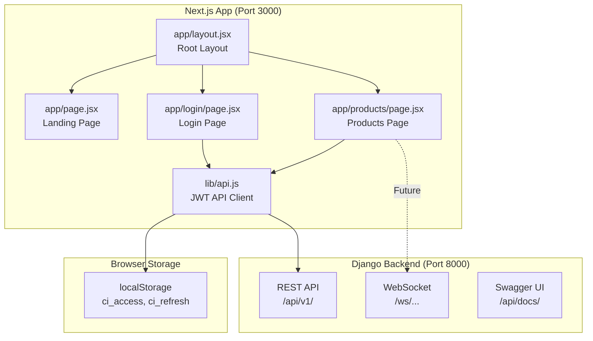
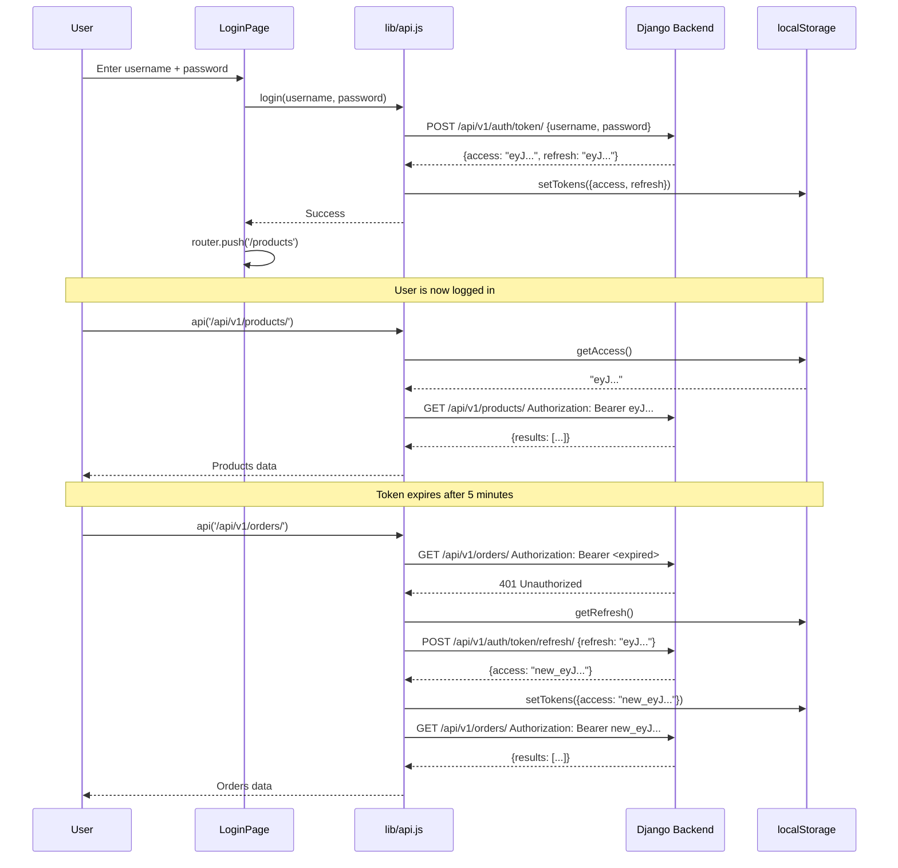

# Frontend Guide - ConvoInsight Platform

> Everything you need to understand the Next.js frontend. Read this before writing any frontend code.

---

## Table of Contents

1. [Architecture Overview](#architecture-overview)
2. [Tech Stack](#tech-stack)
3. [Project Structure](#project-structure)
4. [Authentication Flow](#authentication-flow)
5. [API Client Reference](#api-client-reference)
6. [Pages & Routing](#pages--routing)
7. [How to Add a New Page](#how-to-add-a-new-page)
8. [Styling Guide](#styling-guide)
9. [Testing](#testing)
10. [Common Patterns](#common-patterns)
11. [Future Pages to Build](#future-pages-to-build)

---

## Architecture Overview



The frontend is a **Next.js 15 App Router** application using **JSX only** (no TypeScript). It communicates with the Django backend via REST API and WebSockets.

---

## Tech Stack

| Technology | Version | Purpose |
|-----------|---------|---------|
| **Next.js** | 16.2.6 | React framework with App Router (Turbopack default) |
| **React** | 19.2.6 | UI library |
| **Auth.js (next-auth)** | 5.0.0-beta.31 | Cockpit session layer over Django JWT |
| **TailwindCSS** | 3.4.1 | Utility-first CSS framework |
| **Vitest** | 4.1.7 | Unit testing framework |
| **Testing Library** | 16.3.2 | React component testing utilities |

> **Important**: This project uses **JSX only**. Never create `.ts` or `.tsx` files.
>
> **Auth posture**: tokens are not stored in `localStorage`. The Django JWT pair is held inside an Auth.js encrypted session cookie. The Auth.js wiring is documented end-to-end in [AUTHJS_INTEGRATION.md](./AUTHJS_INTEGRATION.md) — read that doc before touching any auth-adjacent code.

---

## Project Structure

```
frontend/
├── app/                          # Next.js App Router pages
│   ├── layout.jsx                # Root layout (metadata, global styles)
│   ├── page.jsx                  # Landing page (/)
│   ├── globals.css               # Global CSS (Tailwind directives)
│   ├── login/
│   │   └── page.jsx              # Login page (/login)
│   └── products/
│       └── page.jsx              # Products page (/products)
│
├── lib/                          # Shared libraries
│   └── api.js                    # JWT-authenticated API client
│
├── __tests__/                    # Test files
│   ├── app/
│   │   ├── login.test.jsx        # Login page tests
│   │   └── products.test.jsx     # Products page tests
│   └── lib/
│       └── api.test.js           # API client tests
│
├── public/                       # Static assets (images, icons)
│
├── .env.example                  # Environment variables template
├── .gitignore
├── jsconfig.json                 # JS path aliases (@/ -> ./)
├── next.config.js                # Next.js configuration
├── package.json                  # Dependencies and scripts
├── postcss.config.js             # PostCSS config (for Tailwind)
├── tailwind.config.js            # TailwindCSS configuration
├── vitest.config.js              # Vitest configuration
└── vitest.setup.js               # Vitest setup (jest-dom matchers)
```

### Key Config Files

#### `jsconfig.json` - Path Aliases

```json
{
  "compilerOptions": {
    "paths": {
      "@/*": ["./*"]
    }
  }
}
```

This lets you import with `@/lib/api` instead of `../../lib/api`.

#### `tailwind.config.js`

```js
/** @type {import('tailwindcss').Config} */
module.exports = {
  content: [
    './app/**/*.{js,jsx}',
    './lib/**/*.{js,jsx}',
  ],
  theme: { extend: {} },
  plugins: [],
}
```

#### `next.config.js`

```js
/** @type {import('next').NextConfig} */
const nextConfig = {};
module.exports = nextConfig;
```

Minimal config. API URL is handled via environment variable.

---

## Authentication Flow



### Token Storage

Tokens are stored in **localStorage** under these keys:

| Key | Content | Lifetime |
|-----|---------|----------|
| `ci_access` | JWT access token | ~5 minutes |
| `ci_refresh` | JWT refresh token | ~1 day |

### Auth in Code

```jsx
import { getAccess, login, logout } from '@/lib/api';

// Check if user is logged in
if (!getAccess()) {
  router.push('/login');
}

// Login
await login('demo_user_01', 'demo12345');

// Logout (blacklists refresh token, clears storage)
await logout();
```

---

## API Client Reference

The entire API client lives in **one file**: `lib/api.js`. It's a thin wrapper around `fetch` with JWT handling baked in.

### Exported Functions

| Function | Signature | Description |
|----------|-----------|-------------|
| `api(path, options)` | `(string, {method, body, headers, auth}) -> Promise<any>` | Main API call function |
| `login(username, password)` | `(string, string) -> Promise<{access, refresh}>` | Obtain JWT tokens |
| `logout()` | `() -> Promise<void>` | Blacklist refresh token + clear storage |
| `me()` | `() -> Promise<User>` | Get current user profile |
| `getAccess()` | `() -> string \| null` | Read access token from localStorage |
| `getRefresh()` | `() -> string \| null` | Read refresh token from localStorage |
| `setTokens({access, refresh})` | `(object) -> void` | Store tokens in localStorage |
| `clearTokens()` | `() -> void` | Remove tokens from localStorage |

### `api()` Function Details

```javascript
import api from '@/lib/api';

// GET request (default)
const products = await api('/api/v1/products/');

// POST request
const order = await api('/api/v1/orders/', {
  method: 'POST',
  body: { items: [{product_id: 1, quantity: 2}] }
});

// Without auth (public endpoints)
const data = await api('/api/v1/categories/', { auth: false });

// The function automatically:
// 1. Attaches Bearer token from localStorage
// 2. Serializes body to JSON
// 3. On 401, tries to refresh the token and retries
// 4. Parses JSON response
// 5. Throws Error with status and data on failure
```

### Error Handling

```javascript
try {
  const data = await api('/api/v1/products/');
} catch (err) {
  console.log(err.status);   // HTTP status code (e.g., 404, 403)
  console.log(err.data);     // Response body (e.g., {detail: "Not found."})
  console.log(err.message);  // "API error 404"
}
```

### Environment Variable

| Variable | Default | Description |
|----------|---------|-------------|
| `NEXT_PUBLIC_API_URL` | `http://localhost:8000` | Django backend URL |

Set it in `frontend/.env.local`:
```
NEXT_PUBLIC_API_URL=http://localhost:8000
```

---

## Pages & Routing

Next.js App Router uses **file-system routing**. Each folder under `app/` maps to a URL path.

### Current Pages

| Route | File | Auth Required | Description |
|-------|------|---------------|-------------|
| `/` | `app/page.jsx` | No | Landing page with links to login and products |
| `/login` | `app/login/page.jsx` | No | Login form, stores JWT tokens |
| `/products` | `app/products/page.jsx` | Yes | Product listing from API |

### Page Details

#### `/` - Landing Page (`app/page.jsx`)

- Server component (no `'use client'`)
- Shows two cards: Login and Products Demo
- Links to Swagger UI

#### `/login` - Login Page (`app/login/page.jsx`)

- Client component (`'use client'`)
- Pre-filled with demo credentials (`demo_user_01` / `demo12345`)
- On success: stores tokens via `login()` and redirects to `/products`
- On error: shows error message

#### `/products` - Products Page (`app/products/page.jsx`)

- Client component
- Auth guard: redirects to `/login` if no access token
- Fetches products from `/api/v1/products/` on mount
- Shows product list with name, description, price, stock
- Logout button that blacklists token and redirects

---

## How to Add a New Page

### Step-by-step Example: Orders Page

```bash
# 1. Create the page directory
mkdir -p frontend/app/orders
```

```jsx
// 2. Create frontend/app/orders/page.jsx
'use client';

import { useEffect, useState } from 'react';
import { useRouter } from 'next/navigation';
import { api, getAccess, logout } from '@/lib/api';

export default function OrdersPage() {
  const router = useRouter();
  const [orders, setOrders] = useState(null);
  const [error, setError] = useState('');

  useEffect(() => {
    if (!getAccess()) {
      router.push('/login');
      return;
    }
    api('/api/v1/orders/')
      .then(setData => setOrders(setData))
      .catch(err => setError(err.data?.detail || err.message));
  }, [router]);

  async function onLogout() {
    await logout();
    router.push('/login');
  }

  const statusColors = {
    PE: 'bg-yellow-100 text-yellow-800',
    PR: 'bg-blue-100 text-blue-800',
    SH: 'bg-indigo-100 text-indigo-800',
    DE: 'bg-green-100 text-green-800',
    CA: 'bg-red-100 text-red-800',
  };

  return (
    <main className="mx-auto max-w-4xl px-6 py-10">
      <header className="flex items-center justify-between">
        <h1 className="text-2xl font-bold">My Orders</h1>
        <button onClick={onLogout} className="text-sm text-slate-600 underline">
          Log out
        </button>
      </header>

      {error && <p className="mt-4 rounded bg-red-50 px-3 py-2 text-red-700">{error}</p>}
      {!orders && !error && <p className="mt-4 text-slate-500">Loading...</p>}

      {orders && (
        <div className="mt-6 space-y-4">
          {orders.results.map(order => (
            <div key={order.id} className="rounded-lg border border-slate-200 bg-white p-4">
              <div className="flex items-center justify-between">
                <p className="font-semibold">Order #{order.id}</p>
                <span className={`rounded px-2 py-1 text-xs font-medium ${statusColors[order.status] || 'bg-gray-100'}`}>
                  {order.status}
                </span>
              </div>
              <p className="text-sm text-slate-600">Total: ${order.total_amount}</p>
            </div>
          ))}
        </div>
      )}
    </main>
  );
}
```

```bash
# 3. Visit http://localhost:3000/orders
```

### Template for Any New Page

```jsx
'use client';

import { useEffect, useState } from 'react';
import { useRouter } from 'next/navigation';
import { api, getAccess, logout } from '@/lib/api';

export default function MyPage() {
  const router = useRouter();
  const [data, setData] = useState(null);
  const [error, setError] = useState('');
  const [loading, setLoading] = useState(true);

  useEffect(() => {
    // Auth guard
    if (!getAccess()) {
      router.push('/login');
      return;
    }
    // Fetch data
    api('/api/v1/my-endpoint/')
      .then(res => {
        setData(res.results || res);
        setLoading(false);
      })
      .catch(err => {
        setError(err.data?.detail || err.message);
        setLoading(false);
      });
  }, [router]);

  if (loading) return <div className="p-8 text-slate-500">Loading...</div>;
  if (error) return <div className="p-8 text-red-600">{error}</div>;

  return (
    <main className="mx-auto max-w-4xl px-6 py-10">
      <h1 className="text-2xl font-bold">My Page</h1>
      {/* Your content */}
    </main>
  );
}
```

### Key Rules for Pages

1. Always start with `'use client'` if you use hooks or browser APIs
2. Always include an auth guard (`getAccess()` check)
3. Handle loading, error, and empty states
4. Use Tailwind classes for styling (no custom CSS files)
5. File must be named `page.jsx`
6. Export the component as `default`

---

## Styling Guide

### TailwindCSS

All styling uses **utility classes** from TailwindCSS. No separate CSS files needed.

#### Common Patterns

```jsx
// Page wrapper
<main className="mx-auto max-w-4xl px-6 py-10">

// Card
<div className="rounded-lg border border-slate-200 bg-white p-4 shadow-sm">

// Button
<button className="rounded-md bg-slate-900 px-4 py-2 text-white hover:bg-slate-800">
  Click me
</button>

// Status badge
<span className="rounded-full bg-green-100 px-3 py-1 text-xs font-medium text-green-800">
  Active
</span>

// Error message
<p className="rounded bg-red-50 px-3 py-2 text-red-700">Something went wrong</p>

// Grid layout
<div className="grid grid-cols-1 sm:grid-cols-2 lg:grid-cols-3 gap-4">

// Flex between
<div className="flex items-center justify-between">
```

#### Color Palette

The project uses **slate** as the primary gray:
- `slate-50` through `slate-900` for backgrounds, text, borders
- `blue-600` for links and primary actions
- `red-50`/`red-600` for errors
- `green-50`/`green-600` for success
- `yellow-50`/`yellow-600` for warnings

---

## Testing

### Test Setup

| File | Purpose |
|------|---------|
| `vitest.config.js` | Vitest + jsdom + React plugin config |
| `vitest.setup.js` | `@testing-library/jest-dom` matchers |
| `__tests__/` | All test files mirror the `app/` structure |

### Running Tests

```bash
cd frontend

# Run all tests
npm test

# Run in watch mode
npm run test:watch

# Run with coverage
npm run test:coverage
```

### Test Structure

Tests mirror the source structure:
```
__tests__/
├── app/
│   ├── login.test.jsx         # Tests for login page
│   └── products.test.jsx      # Tests for products page
└── lib/
    └── api.test.js            # Tests for API client
```

### Writing a Page Test

```jsx
// __tests__/app/my-page.test.jsx
import { render, screen } from '@testing-library/react';
import { describe, it, expect, vi } from 'vitest';
import MyPage from '@/app/my-page/page';

// Mock the API module
vi.mock('@/lib/api', () => ({
  getAccess: vi.fn(() => 'mock-token'),
  api: vi.fn(() => Promise.resolve({ results: [] })),
  logout: vi.fn(),
}));

describe('MyPage', () => {
  it('renders the page title', () => {
    render(<MyPage />);
    expect(screen.getByText('My Page')).toBeInTheDocument();
  });
});
```

### Writing an API Test

```javascript
// __tests__/lib/my-test.test.js
import { describe, it, expect, vi, beforeEach } from 'vitittest';
import { api, login, clearTokens } from '@/lib/api';

describe('api()', () => {
  beforeEach(() => {
    localStorage.clear();
  });

  it('makes a GET request', async () => {
    // Mock fetch
    global.fetch = vi.fn(() =>
      Promise.resolve({
        ok: true,
        headers: new Headers({ 'content-type': 'application/json' }),
        json: () => Promise.resolve({ results: [] }),
      })
    );

    const result = await api('/api/v1/products/', { auth: false });
    expect(result).toEqual({ results: [] });
  });
});
```

---

## Common Patterns

### WebSocket Connection from Frontend

```javascript
'use client';

import { useEffect, useState, useRef } from 'react';
import { getAccess } from '@/lib/api';

export default function ChatPage() {
  const [messages, setMessages] = useState([]);
  const [input, setInput] = useState('');
  const wsRef = useRef(null);

  useEffect(() => {
    const token = getAccess();
    if (!token) return;

    const ws = new WebSocket(`ws://localhost:8000/ws/support-agent/test-conv/?token=${token}`);
    wsRef.current = ws;

    ws.onmessage = (e) => {
      const data = JSON.parse(e.data);
      if (data.type === 'agent_response') {
        setMessages(prev => [...prev, { from: 'agent', text: data.message }]);
      }
    };

    return () => ws.close();
  }, []);

  function sendMessage() {
    if (wsRef.current && input.trim()) {
      wsRef.current.send(JSON.stringify({ type: 'message', message: input }));
      setMessages(prev => [...prev, { from: 'user', text: input }]);
      setInput('');
    }
  }

  return (
    <main className="mx-auto max-w-2xl px-6 py-10">
      <div className="space-y-4">
        {messages.map((msg, i) => (
          <div key={i} className={msg.from === 'user' ? 'text-right' : 'text-left'}>
            <span className="inline-block rounded-lg bg-slate-100 px-4 py-2">
              {msg.text}
            </span>
          </div>
        ))}
      </div>
      <div className="mt-4 flex gap-2">
        <input
          value={input}
          onChange={(e) => setInput(e.target.value)}
          onKeyDown={(e) => e.key === 'Enter' && sendMessage()}
          className="flex-1 rounded-md border border-slate-300 px-3 py-2"
          placeholder="Type a message..."
        />
        <button onClick={sendMessage} className="rounded-md bg-slate-900 px-4 py-2 text-white">
          Send
        </button>
      </div>
    </main>
  );
}
```

### Authenticated Data Fetching Pattern

```jsx
'use client';

import { useEffect, useState } from 'react';
import { useRouter } from 'next/navigation';
import { api, getAccess } from '@/lib/api';

export default function DataPage({ endpoint }) {
  const router = useRouter();
  const [data, setData] = useState(null);
  const [error, setError] = useState('');
  const [loading, setLoading] = useState(true);

  useEffect(() => {
    if (!getAccess()) {
      router.push('/login');
      return;
    }

    api(endpoint)
      .then(res => {
        setData(res.results || res);
        setLoading(false);
      })
      .catch(err => {
        if (err.status === 401) {
          router.push('/login');
          return;
        }
        setError(err.data?.detail || err.message);
        setLoading(false);
      });
  }, [endpoint, router]);

  if (loading) return <div className="p-8 text-slate-500">Loading...</div>;
  if (error) return <div className="p-8 text-red-600">{error}</div>;

  return data;
}
```

### Navigation with Shared Layout

Add a navbar by creating a shared layout component:

```jsx
// app/layout.jsx (update the root layout)
import Link from 'next/link';
import './globals.css';

export const metadata = {
  title: 'ConvoInsight',
  description: 'Customer conversational intelligence platform',
};

export default function RootLayout({ children }) {
  return (
    <html lang="en">
      <body className="min-h-screen bg-slate-50 text-slate-900 antialiased">
        <nav className="border-b border-slate-200 bg-white">
          <div className="mx-auto flex max-w-4xl items-center justify-between px-6 py-3">
            <Link href="/" className="text-lg font-bold">ConvoInsight</Link>
            <div className="flex gap-4 text-sm">
              <Link href="/products" className="text-slate-600 hover:text-slate-900">Products</Link>
              <Link href="/orders" className="text-slate-600 hover:text-slate-900">Orders</Link>
            </div>
          </div>
        </nav>
        {children}
      </body>
    </html>
  );
}
```

---

## Future Pages to Build

These pages are on the roadmap and make great intern projects:

### Dashboard (`/dashboard`)

- Key metrics cards (total conversations, avg sentiment, agent performance)
- Recent conversations list
- Sentiment distribution chart
- Trending topics

**APIs to use**: `/api/v1/conversation-metrics/`, `/api/v1/agent-performance/`, `/api/v1/recommendations/`

### Chat Interface (`/chat`)

- WebSocket connection to support agent
- Message bubbles with streaming tokens
- Tool call indicators
- Conversation history sidebar

**WebSocket**: `ws://localhost:8000/ws/support-agent/<conv_id>/?token=...`

### Orders Management (`/orders`)

- Order list with status filters
- Order detail with tracking timeline
- Create order form

**APIs to use**: `/api/v1/orders/`, `/api/v1/orders/{id}/tracking/`

### Analytics (`/analytics`)

- Sentiment trends over time (line chart)
- Topic distribution (pie chart)
- Agent performance scores (bar chart)
- Intent prediction accuracy

**APIs to use**: `/api/v1/topic-distributions/`, `/api/v1/intent-predictions/`, `/api/v1/sentiments/`

**Chart library**: Consider adding `recharts` for data visualization:
```bash
npm install recharts
```

### NLP Playground (`/playground`)

- Text input area
- Method selector (Fine-tuned BERT / Few-shot GPT / RAG)
- Task selector (Sentiment / Intent / Topic / NER)
- Results display with confidence scores

**WebSocket**: `ws://localhost:8000/ws/playground/`
